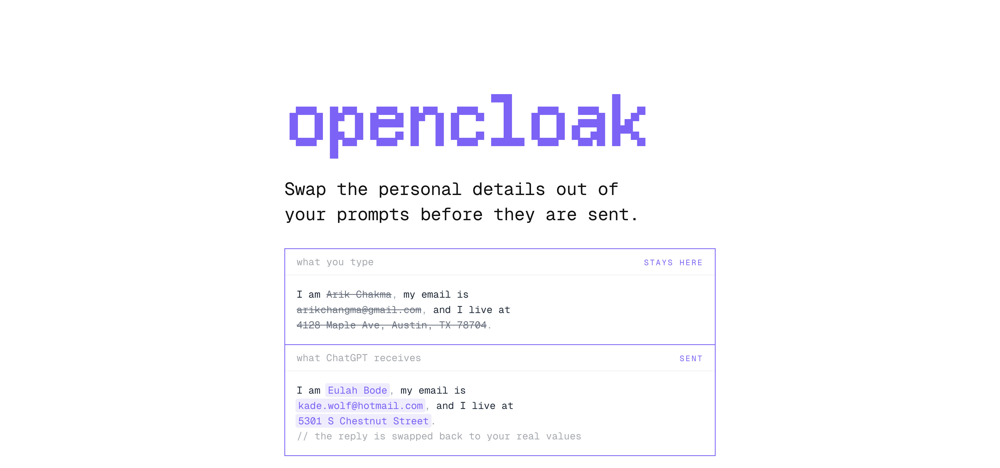

<p align="center">Swap the personal details out of your AI prompts before they are sent.</p>

OpenCloak reads a prompt on your own machine and finds the details that identify you. It
then offers believable fakes in their place. The model runs on your GPU through WebGPU, so
the text never leaves the device to be read.

Press Enter on ChatGPT, Claude, Gemini, Perplexity, Grok or DeepSeek, and OpenCloak holds
the prompt. A card opens above the composer and shows the prompt as it would be sent. Each
detail is a chip. You can untick a chip to keep the real value, or reroll it for a
different fake. After you send, the reply comes back in your own terms, and OpenCloak
marks each restored value with the fake that the model received.

## Why OpenCloak

Everything happens in the page. There is no server and no account.

- The model runs on your GPU inside the page. Your prompt never leaves the device to be
  read.
- ChatGPT sends the characters you type before you press send. A guard answers that
  request locally.
- The card shows the prompt as it will really be sent. Nothing goes out until you agree.
- A value always gets the same fake, so the conversation still makes sense.
- Each restored value shows the fake the model received when you hover it.

## Installation

- Download the latest `opencloak-<version>-chrome.zip` from
  [releases](https://github.com/arikchakma/opencloak/releases)
- Unzip it, since Chrome cannot load a zip directly
- Open `chrome://extensions` and turn on **Developer mode**
- Choose **Load unpacked** and pick the unzipped folder
- Pin OpenCloak to the toolbar, so the icon opens the side panel

Detection needs WebGPU, which Chrome has had since version 113. If the card never appears,
open `chrome://gpu` and look for `WebGPU: Hardware accelerated`.

## Development

```sh
pnpm install
pnpm dev
pnpm check
pnpm compile
pnpm build
```

`pnpm install` also copies the model files into `public/`. `pnpm dev` launches Chrome with
the extension loaded and reloads it as you edit. `pnpm build` writes an unpacked build to
`.output/chrome-mv3`, which you can load the same way as a release.

## Known edges

- The model is experimental. Treat a clean scan as "nothing obvious found", not as proof
  that the text is safe to share.
- The guard covers ChatGPT. Other sites can prefetch too, and none of them is handled yet.
- To rewrite the prompt, OpenCloak tries `execCommand("insertText")`, then a synthetic
  paste, then writing the DOM directly. If none of them take, it refuses to send rather
  than let the real text through.
- OpenCloak swaps a fake back wherever it appears in a reply. A fake that happens to be a
  common word can be restored somewhere you did not mean it to be.
- Restoring real values in a streaming reply joins neighbouring text nodes, so a fake
  split across chunks is still caught. One split across two elements is not.
- A switch in the side panel takes effect on the next page load.

## Acknowledgements

OpenCloak builds on:

- [gpu-pii](https://www.npmjs.com/package/gpu-pii) — the on-device detector. An
  experimental PII model trained from scratch, run through WebGPU.
- [NVIDIA Nemotron-PII](https://huggingface.co/datasets/nvidia/Nemotron-PII) — the training
  data behind that model, under
  [CC BY 4.0](https://creativecommons.org/licenses/by/4.0/). Amy Steier, Andre Manoel,
  Alexa Haushalter, and Maarten Van Segbroeck. *Nemotron-PII: Synthesized Data for
  Privacy-Preserving AI*. NVIDIA, 2025.
- [WXT](https://wxt.dev) — the extension toolchain, for entrypoints, the shadow-root UI and
  the build.
- [Base UI](https://base-ui.com) — the switch and checkbox behavior, which survives being
  rendered inside a shadow root.
- [Faker](https://fakerjs.dev) — the replacement values.

## License

MIT © Arik Chakma. The on-device model, its training data, and the libraries the extension
bundles retain their own licenses, listed in
[THIRD_PARTY_NOTICES.md](THIRD_PARTY_NOTICES.md).
